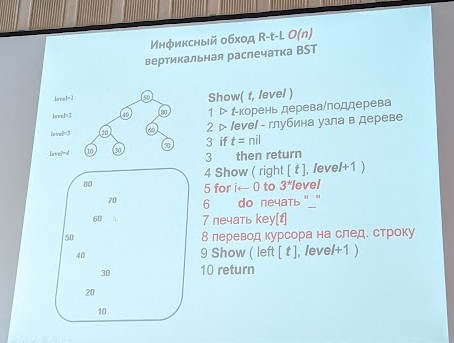

# Практическая работа "Коллекция данных - дерево поиска"
## Вариант 3
1. Алгоритмы операций поиска, вставки и удаления реализуются в рекурсивной форме.
2. Вывод на экран последовательности ключей при обходе узлов дерева по схеме Lt → t → Rt.
3. Дополнительная операция: поиск и подъем в корень дерева узла с ближайшим ключом, большим заданного значения. Трудоёмкость операции – O(log n).
## Заметки
* Операции прямого и обратного итератора выполняются по схеме симметричного обхода элементов дерева L → t → R,
* Предпочтительно использовать правило правило замещающего узла при удалении. Если использовтаь что-то другое необходимо доказать, что используемый алгоритм не хуже!
* Для вывода используем инфиксный обход (см. рис. 1).

